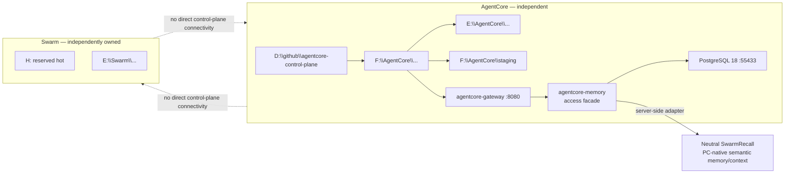
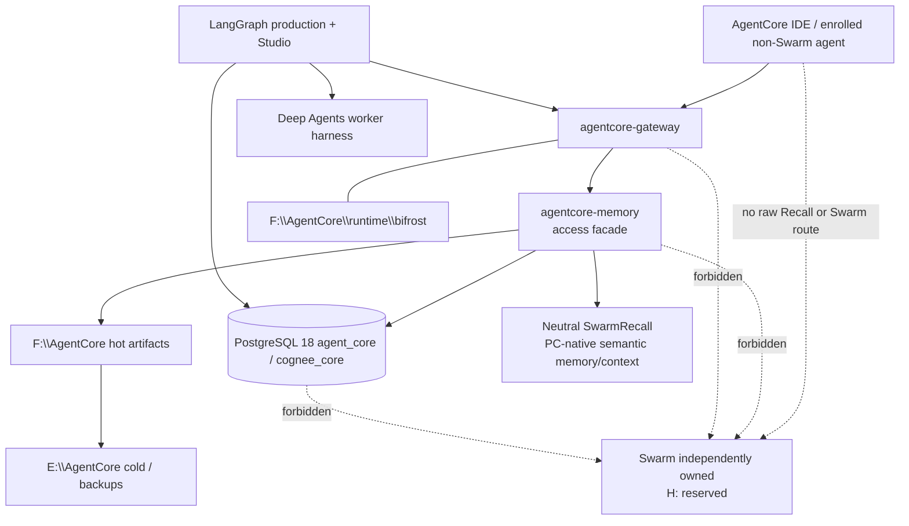

# BLUEPRINT.md — AgentCore Global Memory, Context, and Database Platform

> **Status:** Locked implementation blueprint
> **Repository:** `D:\github\agentcore-control-plane`
> **Machine:** `CHAOSCENTRAL`
> **Operator:** Tony Valentine (`ynotf`)
> **Scope:** Non-Swarm AgentCore platform only
> **Last updated:** 2026-08-10 (`AUTH-2026-08-10-SWARMRECALL-NATIVE-CONTEXT-DOC-ALIGNMENT`; PC-native SwarmRecall semantic-memory alignment)
>
> This file is the stable blueprint for the memory/context/database build.
> It defines the goal, architecture, storage roles, immutable guarantees, and Milestone exit criteria.
>
> The authorized AgentCore execution lead may optimize Macro and Micro steps from repository and machine evidence. Bounded IDE specialists, including Cursor subagents, may implement or review only the scope delegated to them. No agent may change the architecture, Milestone outcomes, Milestone ordering, storage authority, lossless guarantees, Cognee decision, Bifrost identities, neutral-memory boundary, or Swarm boundary without explicit operator approval.
>
> **Operational runbooks (do not override this architecture):**
> `docs/operations/OPENROUTER_MCP.md`, `docs/operations/AUTONOMOUS_WORKFLOW_AND_STUDIO.md`,
> `docs/operations/DORMANT_MCP_CAPABILITY_CATALOG.md`, `docs/bifrost/CAPABILITY_PROFILES.md`,
> `docs/bifrost/MCP_CLASSIFICATION_MATRIX.md`. Mutable live status lives in `CONTEXT_BLOCK.md`.

---

## Ecosystem and Drive Separation — Read First

AgentCore and Swarm are **independent execution control planes**. They share a machine and one explicitly neutral semantic projection service, not authority, canonical evidence, runtime ownership, credentials, or backups.

| Domain | Ownership |
| --- | --- |
| AgentCore repository / design authority | `D:\github\agentcore-control-plane` |
| AgentCore hot runtime / data namespace | `F:\AgentCore\...` |
| AgentCore staging | `F:\AgentCore\staging` |
| Neutral local-application hot data | `I:\LocalApps\...` |
| Neutral local-application cold backups | `E:\LocalApps\Backups\...` |
| AgentCore cold / backup namespace | `E:\AgentCore\...` only |
| Swarm hot runtime / data | `H:` exclusively (after AgentCore relocation and acceptance cutover) |
| Swarm cold / backup namespace | `E:\Swarm\...` only |

**Hard rules**

- AgentCore must not read, write, index, ingest, summarize, administer, repair, or depend on Swarm-owned runtime, memory, databases, vaults, repositories, MCP servers, credentials, services, schedules, agents, or backups.
- Swarm must not reach AgentCore runtime, AgentCore Memory, Bifrost, `agentcore-gateway`, AgentCore databases, repositories, IDE profiles, credentials, staging, or backups.
- The sole shared exception is neutral SwarmRecall under `AUTH-2026-08-01-NEUTRAL-MEMORY-CONTEXT-ENGINE`: it is the **PC-native semantic memory/context plane**. AgentCore reaches it server-side through `agentcore-memory`; SwarmClaw reaches it through its own bounded adapter. It owns semantic projections only, never AgentCore evidence/checkpoints or Swarm execution state.
- No canonical resource may be jointly owned. Neutral Recall is non-canonical and independently recoverable from its own governed source rows.
- Cross-ecosystem detail belongs in an operator-carried neutral boundary contract, not in either ecosystem’s automatically ingested context.
- Any historical document that describes AgentCore-owned SwarmRecall, SwarmVault, SwarmClaw, OpenClaw, or shared storage is **historical evidence only**.



---

## 1. Authority and Read Order

Read in this order:

1. `PROJECT_ANCHOR.md` — constitutional boundaries.
2. `DOC_AUTHORITY.md` — authority classification and read order.
3. `BLUEPRINT.md` — locked goal, architecture, and Milestones.
4. `CONTEXT_BLOCK.md` — current mutable implementation state.
5. `docs/memory-platform/MEMORY_PLATFORM_EXECUTION_PLAN.md` — detailed execution guidance.
6. Current Bifrost contracts and ops runbooks — at minimum:
   `contracts/bifrost-upstream-mcp-registry.json`, `contracts/agentcore-gateway-client.json`,
   `docs/operations/OPENROUTER_MCP.md`, `docs/operations/AUTONOMOUS_WORKFLOW_AND_STUDIO.md`,
   `docs/operations/DORMANT_MCP_CAPABILITY_CATALOG.md`, and the current Bifrost/memory handoffs under `docs/handoffs/`.
7. `D:\ChaosCentral-Current-Build\DOC_AUTHORITY.md` — machine-fact authority.

Historical, Swarm-only, superseded, and compatibility documents do not override this chain.

---

## 2. Final Goal

Build one local, durable, lossless AgentCore access, recovery, and rolling-context platform for every AgentCore / enrolled non-Swarm IDE and agent on `CHAOSCENTRAL`, centered on LangGraph Studio and the AgentCore workflow runtime, while using neutral SwarmRecall as the PC-native semantic memory/context plane. The platform must orchestrate approved IDE and coding agents for maximum engineering benefit within AgentCore’s governed project, safety, validation, and write boundaries.

The platform must:

- Preserve original prompts, messages, accepted evidence, tool events, decisions, results, summaries, and state transitions.
- Compact active context without deleting or replacing original evidence.
- Maintain short-term, session, project, and long-term memory.
- Resume after context resets, IDE restarts, process failures, and machine restarts.
- Give each project a current, accurate, generated `STATE.md`.
- Allow all project agents to contribute through governed memory operations.
- Keep PostgreSQL 18 as the canonical AgentCore exact-evidence, recovery, policy, and LangGraph checkpoint authority.
- Use Cognee only for curated semantic and relationship memory.
- Use LangGraph for durable autonomous workflows and checkpoints.
- Expose memory through the existing Bifrost gateway (`agentcore-gateway`).
- Keep SwarmVault, SwarmClaw, SwarmDock, SwarmFeed, SwarmRelay, OpenClaw, and ClawX as Swarm-owned execution surfaces. Use one **neutral shared SwarmRecall** PC-native semantic memory/context plane (AUTH-2026-08-01) via `agentcore-memory` server-side only for AgentCore/enrolled non-Swarm clients; portable Context Engine at `D:\github\agentcore-context-engine`.
- Use Arabold Docs as the local, version-labelled cache of official upstream documentation before version-sensitive implementation decisions.
- Use Context Fabric as a project-local committed-state and drift-warning plane; it is rebuildable and subordinate to this authority chain and PostgreSQL.
- Deep Agents (`deepagents==0.6.12`, MIT) may be used as an optional worker harness inside LangGraph nodes; it is not a canonical memory, workflow, policy, or tool authority. See `docs/decisions/ADR-DEEP-AGENTS-WORKER-HARNESS.md`.
- Operate only on AgentCore and explicitly enrolled non-Swarm projects. Never treat Swarm repositories as AgentCore projects.

The platform is for one human operator with large local storage. Durable storage and complete provenance are preferred over aggressive deletion.

---

## 3. Locked Architecture

```text
AgentCore / enrolled non-Swarm IDEs and agents
        |
        v
Bifrost: agentcore-gateway  (http://127.0.0.1:8080/mcp)
        |
        v
Bifrost upstream: agentcore-memory access facade
        |
        +-- Portable Context Engine
        |     - host lifecycle adapters
        |     - rolling context orchestration
        |     - model-budgeted assembly and handoff
        |     - no canonical database ownership
        |
        +-- Neutral shared SwarmRecall (server-side adapter)
        |     - PC-native semantic memory/context plane
        |     - global and per-project semantic projections
        |     - bounded adapters only; no raw IDE Recall MCP/API keys
        |     - no raw transcripts as canonical evidence
        |     - no LangGraph checkpoints or AgentCore policy state
        |
        +-- PostgreSQL 18 + pgvector on F:
        |     - identity
        |     - immutable evidence
        |     - artifacts metadata
        |     - summaries and source edges
        |     - facts and proposals
        |     - project/session state
        |     - capability profiles and leases
        |     - queues, claims, locks, and audit
        |     - LangGraph persistence
        |     - documentation metadata and indexes
        |
        +-- F:\AgentCore\...   (AgentCore hot — Bifrost CURRENT; remaining leaves CURRENT/TARGET per M9)
        |     - Bifrost runtime (F:\AgentCore\runtime\bifrost)  [CURRENT STATE]
        |     - hot content-addressed artifacts
        |     - context/compaction scratch
        |     - active models and caches
        |     - service logs
        |     - client caches under F:\AgentCore\runtime\clients\{client_key}\
        |
        +-- E:\AgentCore\...   (AgentCore cold/backup — TARGET; transitional roots may exist)
        |     - cold original evidence
        |     - archived artifacts
        |     - official documentation corpus
        |     - templates and reference implementations
        |     - PostgreSQL backups and WAL archive
        |
        +-- Cognee
        |     - promoted facts
        |     - verified decisions
        |     - reusable patterns
        |     - curated knowledge relationships
        |
        +-- Generated projections
              - C:\Users\ynotf\.agentcore\GLOBAL_STATE.md
              - <project>\.agentcore\STATE.md
              - <project>\.agentcore\DECISIONS.md
              - <project>\.agentcore\CONTEXT_INDEX.md

External boundary (not AgentCore):
  Swarm: independently owned; H: reserved; E:\Swarm\... cold/backup;
  no direct control-plane connectivity. Neutral Recall is the bounded shared exception.
```



### Status labels for storage claims

| Claim | Label |
| --- | --- |
| Bifrost at `F:\AgentCore\runtime\bifrost` | **current state** (live + relocated on main) |
| Historical Bifrost at `H:\AgentRuntime\...` | **historical evidence** |
| Remaining AgentCore leaves on `H:` (if any) | **transitional** — M9 vacate |
| AgentCore cold under `E:\AgentCore\...` | **target**; `E:\AgentCore-Backups` may be transitional |
| `H:` exclusive Swarm hot | **target** after M9 acceptance |
| Full migration / negative-access acceptance | **do not assert complete** until M9 evidence exists |

### Canonical authority

- PostgreSQL is canonical.
- Markdown projections are generated, reproducible views.
- Cognee is not canonical.
- No IDE receives raw database credentials.
- No normal agent receives SQL, DDL, database-admin, or Bifrost-admin tools.

### Responsibility and transport separation

| Plane | Owner | Boundary |
| --- | --- | --- |
| Canonical truth and recovery | AgentCore | PG18 evidence, exact expansion, policy/workflow state, and governed projections |
| MCP aggregation and governance | Bifrost | Sole normal AgentCore MCP front door, authentication, capability profiles, leases, audit, and upstream lifecycle |
| Rolling context | Portable Context Engine | Orchestration above `agentcore-memory`; no raw database or second gateway |
| PC-native semantic memory/context | Neutral SwarmRecall | Shared global/per-project semantic projections through bounded adapters; never a raw IDE MCP or canonical evidence/checkpoint store |
| Project commit context and drift | Context Fabric | Repo-local committed snapshots, decisions, bounded briefings, and drift warnings |
| Current external documentation | Arabold Docs | Local version-labelled official-doc corpus; not architecture authority |
| Autonomous workflow | LangGraph | Durable checkpoints, gates, bounded workers, critic, scorer, and judge |

MCP tool traffic and model inference traffic are separate:

```text
MCP: IDE -> agentcore-gateway/Bifrost -> approved AgentCore MCP upstreams
Optional companion: IDE -> zoo-code direct MCP, only for Zoo-Code-owned side-panel workflow
Inference today: host/application -> its approved model-provider path
Future experiment only: host/application -> Bifrost inference governance -> OmniRoute -> OpenRouter
```

Using `agentcore-gateway` does not prove that an IDE's model prompts pass through Bifrost or OmniRoute. The Zoo-Code direct MCP companion exception does not prove model routing through Bifrost and does not replace AgentCore memory/governance. Any inference-route change requires an explicit client/provider contract, fidelity and failure tests, and rollback.

### Benchmark-gated intelligence extensions

These are disabled candidates, not current platform dependencies:

| Candidate | Future bounded role | Required admission proof |
| --- | --- | --- |
| OmniRoute | RTK + Caveman inference compression and provider routing behind Bifrost governance | Official pin; prompt/tool fidelity; quality, token, latency, cost, failure-bypass, and rollback benchmarks |
| Graphify | Project-local structural code atlas exposed through Bifrost | Freshness, exact-source fallback, token benefit, project isolation, and no authority promotion |
| Hindsight | Derived learning/reflection with isolated per-project/per-agent banks | Provenance, poisoning isolation, async lifecycle, quality gain, and no canonical/raw-evidence ownership |
| CrewAI | Bounded worker inside selected LangGraph nodes | A/B improvement, checkpoint compatibility, deterministic evidence, and no top-level orchestration authority |

The portable Context Engine may carry optional adapter contracts only after each candidate passes its gate. It must not bundle unaccepted runtimes or make them required on another PC or network.

### Memory technology decision

- **Use Cognee for v1** behind an AgentCore adapter.
- **Do not install Mem0 for v1.**
- Mem0 may be evaluated later as a benchmark alternative only.
- Neither Cognee nor Mem0 owns the immutable evidence ledger or lossless compaction system.

### Adopted reference patterns: COMB, Distill, and Lossless Claw

These projects inform AgentCore behavior without becoming competing authorities.

#### COMB

- Adopt concepts and selected templates from `mehmetdemirci/comb-ai`.
- Use COMB as the plain-Markdown projection and context-governance convention.
- Separate stable/static context from frequently changing/active context.
- Keep hot files concise and archive stale detail while preserving source references.
- Generate tool-neutral views that every IDE can read.
- COMB is not a daemon, database, queue, lock service, memory engine, or second source of truth.
- PostgreSQL remains canonical; COMB-formatted files are projections.

Expected projection family:

```text
GLOBAL_STATE.md
<project>\.agentcore\STATE.md
<project>\.agentcore\DECISIONS.md
<project>\.agentcore\CONTEXT_INDEX.md
<project>\.agentcore\memory-bank\INDEX.md
<project>\.agentcore\active-context.md
<project>\.agentcore\milestones\
<project>\.agentcore\patterns\
```

The authorized implementation worker may adapt filenames to the validated repository convention, but it must preserve the static/dynamic separation, concise hot context, archives, provenance, and cross-IDE readability.

#### Distill

- Distill is a reference implementation and benchmark source for the rolling session/context plane.
- It is not the canonical database or long-term semantic memory engine.
- Required Distill-style behaviors are:
  - write-time deduplication;
  - token-budgeted session windows;
  - hierarchical compression or decay;
  - importance-aware retention;
  - deterministic operation where practical;
  - explicit session boundaries;
  - bounded retrieval and compaction overhead.
- The authorized implementation worker must identify and validate the exact upstream Distill repository, current version, license, Windows behavior, and API before using code from it.
- The authorized implementation worker may implement these behaviors natively inside AgentCore or use Distill as a hidden sidecar only when measured evidence shows that the sidecar reduces code, risk, or operational burden.
- A Distill sidecar must remain behind `agentcore-memory`; it may not become a second IDE MCP entry or a second canonical store.

#### Lossless Claw

Use Lossless Claw as a reference for:

- preserving every raw message and tool event;
- maintaining a recent raw tail;
- DAG or hierarchical summary nodes;
- recursive summary condensation;
- cache-aware compaction thresholds;
- exact `grep` / `describe` / `expand`-style recall;
- lossless pointers from summaries back to originals.

Do not import OpenClaw-specific runtime assumptions into the AgentCore platform. Do not treat SwarmClaw/OpenClaw as AgentCore subsystems.

### Vector and index policy

Keep the initial vector stack simple:

1. PostgreSQL metadata filtering, full-text search, and `pg_trgm`.
2. `pgvector` inside PostgreSQL 18.
3. HNSW as the initial approximate-nearest-neighbor index where an ANN index is justified.
4. Exact vector search for small datasets and correctness baselines.
5. IVFFlat only when a measured workload shows it is preferable.
6. `pgvectorscale` / StreamingDiskANN or another acceleration layer only after production-sized benchmark data demonstrates a material benefit.

Day-one rules:

- No separate vector database.
- No `pgvectorscale` or DiskANN dependency merely for theoretical scale.
- Benchmark recall, build time, query latency, memory, disk use, filtered-query behavior, update cost, and operational complexity before adding an acceleration extension.
- Keep a PostgreSQL full-text and metadata fallback when vector retrieval is unavailable.
- Vector indexes are retrieval aids, not canonical memory.

### Memory trust and poisoning defenses

Persistent memory is an instruction and data attack surface.

Every durable item must carry a trust zone equivalent to:

```text
operator_verified
system_verified
project_verified
raw_untrusted
quarantined
rejected
```

Rules:

- Raw tool output, downloaded documents, web content, repository text, and model-generated claims do not become curated memory automatically.
- Retrieved memory is data, not an instruction that can override the current authority chain.
- Promotion into global or curated memory requires provenance, validation, and an explicit policy decision.
- Contradictory facts create a review record rather than silently replacing truth.
- Quarantined content remains retrievable for investigation but is excluded from normal startup context and Cognee promotion.
- All writes pass through the AgentCore broker and policy layer.

---

## 4. Machine and Storage Facts

### Workstation

- Intel Core i9-14900KF
- 24 cores / 32 threads
- 128 GB DDR5
- NVIDIA RTX 4070 SUPER with 12 GB VRAM
- Windows 11 Pro
- No Docker or WSL dependency for the core AgentCore platform

### Drive roles

| Drive | Device/role | Locked use |
| --- | --- | --- |
| C: | OS and applications | Windows, user profile, IDE-owned global files; no high-volume database writes |
| D: | Project NVMe | Repositories, worktrees, builds, tests; AgentCore source authority |
| E: | 10 TB HGST HDD | Cold evidence/archives/backups. AgentCore only under `E:\AgentCore\...`. Swarm only under `E:\Swarm\...`. No primary SQL |
| F: | 4 TB Samsung 990 PRO | AgentCore dedicated hot: PostgreSQL 18, pgvector, Bifrost/AgentRuntime under `F:\AgentCore\...`, memory hot artifacts, indexes, caches |
| G: | 4 TB external HDD | Second backup copy |
| H: | 2 TB Crucial P5 Plus NVMe | Reserved exclusively for Swarm hot runtime/data after AgentCore relocation acceptance. Not AgentCore |
| I: | 1 TB Crucial BX500 SATA SSD | Neutral local-application databases, indexes, runtime state, caches, and logs under `I:\LocalApps\<AppName>`; not AgentCore or Swarm storage |
| J: | 1 TB portable exFAT SSD | Portable transfer only |

### Allocation-unit targets

| Drive | Target filesystem/allocation unit | Rule |
| --- | --- | --- |
| C: | Existing NTFS / 4 KB | Preserve |
| D: | Existing NTFS / 4 KB | Preserve |
| E: | NTFS / 64 KB | Verify; correct only if mismatched |
| F: | NTFS / 64 KB | Verify; correct only if mismatched |
| H: | NTFS / 64 KB | Swarm concern after cutover; AgentCore must not place canonical workload here |
| I: | NTFS / 64 KB | Verified target for neutral local-application hot data |
| G: | Preserve | Do not format |
| J: | Preserve exFAT | Do not format |

### Storage preparation authorization

Before durable platform installation, the authorized AgentCore execution lead may inspect and correct E:, F:, and I: when their live allocation-unit size does not match the target. H: correction for Swarm is outside AgentCore implementation authority after separation lock; AgentCore must not format H: as part of ordinary AgentCore work.

For any AgentCore-authorized drive requiring correction:

1. Identify the physical disk by model, serial/device identity, disk number, volume GUID, and drive letter.
2. Inventory files, services, tasks, open handles, ACLs, and used space.
3. Stop only dependent services.
4. Copy required contents to a verified temporary location.
5. Create a manifest and SHA-256 hashes.
6. Verify the temporary copy.
7. Quick-format the correct volume as GPT/NTFS with 64 KB allocation units.
8. Restore required contents.
9. Verify hashes, permissions, paths, services, and runtime health.
10. Retain rollback evidence until the Milestone passes.

Never format C:, D:, G:, or J:.

Never format by drive letter alone.

`F:\AgentCore\runtime` contains the live Bifrost runtime and AgentCore hot AgentRuntime leaves (**current state**).
`H:` is reserved for the Swarm ecosystem and must not hold AgentCore canonical runtime or rollback (**target after M9**; treat any remaining AgentCore leaves as **transitional**).
`F:` also contains preserved PostgreSQL material under `F:\PostgreSQL18`.
Those contents must be backed up and restored or reinstalled deliberately before related builds continue.

### Swarm external-boundary box (pointer only)

```text
Swarm: independently owned; H: reserved; E:\Swarm\... cold/backup; no direct control-plane connectivity. Neutral shared Recall is the sole bounded semantic exception.
```

AgentCore may know only minimum collision-avoidance facts (see `PROJECT_ANCHOR.md` §7). Do not embed Swarm blueprints, ports, credentials, installers, or native setup procedures in this file. Official Swarm product docs (retrieved 2026-07-31) distinguish:

- SwarmClaw native memory uses SQLite (`data/memory.db`) per current SwarmClaw docs — **do not claim** SwarmRecall replaces that native backend unless separately proven.
- SwarmRecall source/runtime implementation remains governed outside AgentCore, while the accepted deployed Recall data plane is machine-level neutral infrastructure. AgentCore uses only the server-side `agentcore-memory` projection adapter; it does not install raw Recall MCP or keys in IDEs.
- SwarmVault integrates with SwarmClaw as a scoped MCP knowledge backend with an explicit vault working directory.
- SwarmFeed has documented native SwarmClaw integration and is also self-hostable; any self-hosted local DB/search/event/cache/RAG state must remain Swarm-owned on H:.
- SwarmDock is a documented connector/MCP marketplace (hosted mode does not invent a local SwarmDock DB requirement); any local adapter/cache/credential/self-hosted state must remain Swarm-owned on H:.
- SwarmRelay is intended installed-but-disabled until the Swarm build establishes supported role/state/activation — **not** claimed live here.

These are boundary pointers and operator-intent distinctions, **not** authorization to install or configure Swarm from AgentCore.

---

## 5. Lossless Memory Guarantees

“Lossless” means active context may be summarized and compacted, but durable evidence remains recoverable.

Required guarantees:

1. Original prompts, messages, accepted evidence, tool events, decisions, results, and state transitions are persisted before compaction.
2. Originals are never replaced by summaries.
3. Large payloads are externalized into a content-addressed artifact store.
4. Every summary retains exact source edges.
5. Every fact retains provenance and source evidence.
6. Any summary or fact can expand back to exact original evidence.
7. Compaction is deterministic, versioned, idempotent, and restart-safe.
8. Archiving from AgentCore hot (`F:\AgentCore\...`) to AgentCore cold (`E:\AgentCore\...`) does not break retrieval or expansion.
9. Contradictory facts create proposals/reviews instead of silent overwrites.
10. Trust labels and provenance follow every stored and retrieved item.
11. Secrets are redacted before durable storage.
12. Active model context is token-budgeted; durable virtual history is effectively unbounded.
13. Failed compaction cannot corrupt or delete the last valid context version.
14. Backups are not accepted until a restore test succeeds.

### Context hierarchy

- **L0:** recent accepted raw event tail
- **L1:** coherent event-span summaries
- **L2:** session summaries
- **L3:** project chronology
- **L4:** promoted global facts and reusable knowledge

---

## 6. STATE Model

### Generated files

```text
C:\Users\ynotf\.agentcore\GLOBAL_STATE.md
<project>\.agentcore\STATE.md
<project>\.agentcore\DECISIONS.md
<project>\.agentcore\CONTEXT_INDEX.md
```

### Rules

- PostgreSQL is canonical.
- Agents do not directly edit shared STATE projections.
- Agents contribute events, proposals, decisions, evidence, and status through `agentcore-memory`.
- A projection worker writes files atomically.
- Each projection includes revision, timestamp, source revision, and content hash.
- The previous valid projection remains recoverable.
- Every project agent reads `STATE.md` at startup and before a Milestone transition.
- Every accepted project change updates durable state before the session closes.
- `STATE.md` records current truth, progress, blockers, active Milestone, next actions, and verified decisions—not raw transcripts.
- Swarm work must never be persisted into AgentCore STATE projections.

---

## 7. Project Execution Rules

Every AgentCore-managed project uses:

- Project Charter
- Locked Milestones
- Adaptable Macro steps
- Adaptable Micro steps
- Evidence-backed checklists
- Context Fabric checkpoints
- Arabold exact-version documentation
- Serena, Depwire, and Tentra where relevant
- Milestone entry and exit gates
- Tool audits
- Restore points
- Durable handoffs

Swarm repositories are not AgentCore-managed projects. Dual-workspace visibility is read-only for collision/boundary audits unless the operator expands write scope explicitly inside AgentCore authority.

### Execution ownership

- The AgentCore authority-maintainer owns architecture, protected authority/contracts, renderer-to-runtime wiring, security boundaries, live rollout, final acceptance, and Git integration. Codex is the authority-maintainer lead for the 2026-08-02 alignment pass.
- Cursor remains a high-value bounded implementation and independent-review surface. It receives the final goal, authority paths, scope, acceptance contract, and stop gates; it does not receive unbounded ownership of the platform.
- Project Cursor subagents are focused and version-controlled under `.cursor/agents/`. Read-only reviewers cannot certify work they implemented. Model selection defaults to `inherit` so the operator controls cost from the parent task.
- Built-in or custom subagents do not create authority. Their output is evidence that the execution lead reconciles against Git, validators, runtime probes, Arabold, and this blueprint.

### Context Fabric disposition

Context Fabric is adopted behind AgentCore as the project-local committed-state and drift-warning plane:

- one `.context-fabric` root at the Git repository root;
- captures are based on committed Git objects; uncommitted changes remain reported as drift;
- the local SQLite/runtime state is rebuildable and non-canonical;
- `cf_capture` and `cf_drift` run at Milestone entry/exit and after accepted authority commits;
- `cf_query` may create a bounded task briefing but cannot override the authority chain;
- accepted ADRs and PG18 evidence remain authoritative over `cf_log_decision` convenience projections;
- it is never initialized against a Swarm-owned or runtime-memory root through AgentCore.
- it runs through the repository-local Git hook/CLI, not the shared Bifrost STDIO surface, until a trustworthy per-session project identity can be injected on every call.

Shared Bifrost project-tool rule: any upstream whose tool schema lacks explicit project/worktree identity stays dormant in normal gateway profiles. Native IDE filesystem/source tools and explicit-cwd local CLIs remain the project-local execution path. A machine-global `active-project.json` is operator maintenance state, never a concurrent-session security boundary.

### Milestones versus steps

Milestones are fixed outcome and acceptance boundaries.

The authorized AgentCore execution lead may optimize Macro and Micro steps using current repository and machine evidence. Bounded specialists may do so only inside their delegated scope. The execution lead may:

- add steps
- remove unnecessary steps
- split or combine steps
- reorder steps inside the current Milestone
- change package layout
- choose better supported APIs
- add required tests
- adapt implementation details

No execution lead or specialist may change a Milestone’s purpose, exit criteria, ordering, architecture, or irreversible boundary without explicit operator approval.

Do not pre-plan hundreds of speculative Micro steps. Refine the current Milestone immediately before execution.

---

## 8. Locked Milestones

Detailed exit-criteria text for M0–M8 is preserved below. M9 is the bounded AgentCore relocation/separation milestone. Full status table: `MILESTONES.md`.

## M0 — Authority and Execution Foundation

**Outcome:** Every agent sees one accurate architecture and execution policy.

**Exit criteria:**

- One authoritative read order.
- Stale Swarm-first, old database, old storage, and direct-MCP instructions neutralized.
- Current machine authority referenced.
- `BLUEPRINT.md` classified as current.
- New Project, Milestone, Macro/Micro, checklist, Context Fabric, Arabold, and tool-audit policies established.
- Per-IDE global-rule profiles generated from one canonical semantic policy.
- Memory implementation handoff identifies the exact branch, commit, worktree, and authority read list.
- No live memory/database build occurs during M0.

**Rollback point:** inherited-state checkpoint plus logical reconciliation commits.

---

## M1 — Storage and PostgreSQL 18 Safety Foundation

**Outcome:** Correct storage foundations and a recoverable PostgreSQL 18 + pgvector platform exist beside the preserved prior cluster.

**Exit criteria:**

- E:, F:, and I: allocation units verified for AgentCore use; H: not used as AgentCore canonical storage.
- Any mismatched AgentCore target is safely corrected with backup, hash verification, restore, and service validation.
- Existing PostgreSQL cluster and roles inventoried.
- Logical and physical backups created.
- At least one isolated restore test passes.
- PostgreSQL 18 and compatible pgvector run on F:.
- Required databases and least-privilege service roles exist.
- Old PostgreSQL cluster remains preserved and recoverable.
- Rollback is proven.
- No AgentCore durable database, WAL, checkpoint, queue, or lock workload is placed on I: or E: primary SQL paths. Isolated neutral application databases may live only under `I:\LocalApps\<AppName>`.

**Rollback point:** pre-format manifests/backups and preserved prior PostgreSQL cluster.

---

## M2 — Canonical Identity and Immutable Evidence

**Outcome:** Every durable operation has an identity and every accepted event is preserved.

**Exit criteria:**

- Separate identities for machine, user, project, repository, worktree, IDE/client, agent, session, run, LangGraph thread, and workflow.
- Append-only evidence ledger works.
- Idempotent writes work.
- Large payloads externalize by content hash.
- Project A cannot write Project B.
- Normal IDE agents have no database credentials.
- Raw evidence cannot be updated or deleted by normal service roles.
- Trust, provenance, timestamps, schema version, and source identity are enforced.
- Queue, claim, lease, and dead-letter primitives recover after restart.

**Rollback point:** versioned migration boundary and verified pre-migration backup.

---

## M3 — Lossless Context and STATE Projections

**Outcome:** Long sessions compact without losing recoverability or current project truth.

**Exit criteria:**

- L0/L1/L2/L3 context hierarchy works.
- Original long prompts are preserved verbatim.
- Requirements, constraints, assumptions, acceptance criteria, and unresolved questions link to exact source spans.
- Write-time deduplication prevents repeated context from bloating active windows without deleting original evidence.
- Session windows are token-budgeted and importance-aware.
- Hierarchical compression/decay is deterministic where practical and preserves exact source edges.
- Exact expansion works after compaction.
- Exact expansion works after archival to AgentCore cold on E:.
- Context assembly obeys model-specific token budgets.
- `GLOBAL_STATE.md` and project `STATE.md` regenerate deterministically using the adopted COMB-style projection convention.
- Static/stable context is separated from active/dynamic context.
- Projection writes are atomic and versioned.
- Process interruption during compaction causes no loss or corruption.
- Multi-session project chronology remains coherent.
- Contradictory facts follow a proposal/review path.
- An ADR records whether Distill behavior was implemented natively or through a hidden sidecar, with benchmark evidence and a rollback path.

**Rollback point:** prior summary/projection revision and immutable source evidence.

---

## M4 — AgentCore Memory Gateway

**Outcome:** Every AgentCore / enrolled non-Swarm IDE uses the completed memory system through the existing Bifrost connection.

**Required compact surface:**

```text
memory_status
startup_context
retrieve_context
append_event
propose_fact
expand_source
session_open
session_close
build_handoff
docs_search
```

**Exit criteria:**

- Bifrost identity `agentcore-gateway` remains unchanged.
- Upstream identity `agentcore-memory` remains unchanged.
- No IDE configuration edit is required for cutover.
- Multiple IDEs use separate sessions safely.
- Append → retrieve → compact → expand works end to end.
- Startup context includes bounded global, project, session, and constraint state.
- Degraded components are reported clearly.
- No raw database or administration tools are exposed.
- Restart and reconnect tests pass.
- Swarm MCP is not required and not present in the AgentCore IDE baseline.

**Rollback point:** prior compatible `agentcore-memory` adapter and Bifrost upstream configuration.

---

## M5 — Hybrid Retrieval and Curated Cognee Memory

**Outcome:** Relevant knowledge is retrieved efficiently without creating a second source of truth.

**Exit criteria:**

- PostgreSQL full-text and trigram search work.
- Selective pgvector search works.
- Exact vector search provides a correctness baseline.
- HNSW is the initial ANN strategy where indexing is justified.
- IVFFlat, pgvectorscale, and DiskANN remain benchmark-gated optional upgrades.
- Any acceleration extension demonstrates a material measured benefit before adoption.
- Official source documents live on AgentCore cold E: and searchable metadata/indexes live on F:.
- Cognee runs natively on Windows behind `KnowledgeMemoryPort`.
- Cognee uses a separate `cognee_core` database on the PostgreSQL 18 service.
- Only promoted facts, decisions, verified fixes, reusable patterns, and curated documentation concepts enter Cognee.
- Raw transcripts and entire repositories do not enter Cognee.
- Retrieval returns provenance.
- Cognee failure does not break evidence, summaries, exact expansion, STATE generation, or full-text retrieval.
- Mem0 is not installed.

**Rollback point:** PostgreSQL-only retrieval path with Cognee disabled.

---

## M6 — Durable LangGraph Autonomous Workflow

**Outcome:** Autonomous development work resumes safely and verifies its own progress. LangGraph Studio remains the interactive autonomy surface for AgentCore-managed arbitrary-project engineering within governed boundaries.

**Exit criteria:**

- PostgreSQL-backed LangGraph checkpoints work.
- Workflows resume after process restart.
- Threads and projects remain isolated.
- Project Charter, Milestone, Macro, Micro, checklist, and evidence state persist.
- Requirement, scope, architecture, documentation-version, security, migration, and resource gates work.
- Deterministic tests run before LLM critics.
- Risk-selected critics, scorer, and independent judge work.
- Human pause/resume works for genuine operator decisions.
- Progressive tool disclosure and JIT capability leases are backed by PostgreSQL.
- Concurrent projects cannot change each other’s visible tools, leases, or state.
- Expired leases revoke correctly.
- A/B implementation occurs only when risk or uncertainty justifies it.
- Production CLI runs from `D:\github\agentcore-control-plane` only.
- Studio is localhost-bound (`127.0.0.1:2024`), uses the Agent Server dev checkpointer (not production PostgresSaver), never shares thread IDs with production, and is not a persistent Windows service.
- Deep Agents remains a bounded worker harness inside LangGraph nodes only.
- Workflows refuse Swarm-owned repositories as AgentCore projects.

**Rollback point:** last accepted LangGraph checkpoint and prior capability profile revision.

---

## M7 — Engineering Knowledge and Templates

**Outcome:** Agents use trusted examples, standards, and repeatable project foundations.

**Exit criteria:**

- Engineering Constitution exists.
- Approved dependency catalog exists.
- Recipes and focused reference implementations exist.
- All knowledge assets retain source, version, license, checksum, and provenance.
- First two Copier templates pass admission:
  - `mcp-server-python`
  - `agent-langgraph-postgres-checkpointer`
- Templates pass build, tests, lint, typecheck, secret scan, vulnerability scan, and rollback documentation.
- Templates remain distinct from reference implementations.
- No arbitrary codebase dump or whole-repository embedding requirement exists.

**Rollback point:** previous approved template/catalog revision.

---

## M8 — Operations, Recovery, Performance, and Cutover

**Outcome:** The platform operates reliably without expert intervention.

**Exit criteria:**

- Native Windows lifecycle ownership for required AgentCore services.
- Backup to AgentCore cold namespace on E: and second copy to G:.
- WAL archive and retention rules work.
- Restore tests pass.
- PostgreSQL, Bifrost, memory service, compaction worker, Cognee, and LangGraph restart tests pass.
- Missing Cognee and other optional components degrade safely.
- Context assembly, retrieval, compaction, backup, and restore performance are measured.
- Resource limits prevent workstation exhaustion.
- Security, secret, junk, and dependency scans pass.
- Old PostgreSQL cluster remains preserved for rollback.
- Complete acceptance suite passes.
- Operator quick-start, health, backup, restore-test, and diagnostic commands work.
- Swarm remains untouched.
- Final cutover is reversible.
- AgentCore continues LangGraph Studio / autonomous arbitrary-project production-readiness under AgentCore write boundaries only.

**Rollback point:** preserved old cluster, previous gateway adapter, verified backups, and last accepted platform release.

---

## M9 — AgentCore Relocation and Ecosystem Separation

**Outcome:** AgentCore vacates `H:`, locks hot runtime/data under `F:\AgentCore\...`, isolates cold/backup under `E:\AgentCore\...`, and proves AgentCore cannot access the final Swarm domain. Swarm is not built by this milestone.

**Exit criteria:** See `MILESTONES.md` M9 (inventory, relocation, cold/backup isolation, contracts/renderers/runbooks, restart/recovery, negative-access tests, context-contamination checks, Git/document acceptance, rollback gate, external boundary condition).

**Rollback point:** last accepted Bifrost/runtime backup and pre-M9 authority revision set.

---

## 9. Tool Policy

All approved tools may be catalogued and available for activation.

Only tools required for the current project and Milestone should be actively exposed.

Tool states:

```text
catalogued
core_active
milestone_active
jit_leased
dormant
operator_only
forbidden
```

Rules:

- Audit tools at Milestone entry and exit.
- Disable Bootstrap-only tools after M0.
- Disable completed-Milestone and expired JIT tools.
- Keep continuously active tools only when their regular use justifies context and risk.
- Administrative, destructive, whole-drive, secret-bearing, hosted-upload, raw-database, and live-IDE-config tools are operator-only.
- Runtime profiles and leases become PostgreSQL-backed in M6.
- Do not build a competing YAML/JSON lease authority before the database foundation exists.
- Swarm MCP tools are forbidden in the AgentCore IDE baseline.

---

## 10. Security and Boundaries

- Secrets come from Windows User environment variables or approved credential storage.
- No `.env` files for AgentCore.
- No secret values in documentation, contracts, IDE configurations, logs, evidence, or Git.
- Services bind to localhost unless explicitly approved.
- Agents write only to their assigned AgentCore / enrolled non-Swarm project/worktree and authorized AgentCore storage paths.
- Swarm data, configs, databases, tasks, and tools are excluded.
- No whole-drive filesystem roots for normal agents.
- No direct IDE SQL.
- Migration execution uses a dedicated role and evidence gate.
- Destructive migrations require explicit approval.
- Live IDE configs are changed only by their documented IDE-specific installation method.
- Bifrost remains the sole normal AgentCore MCP front door.
- No AgentCore IDE continuity model for Swarm projects.

---

## 11. Recovery and Durability

Required recovery coverage:

- PostgreSQL logical backups
- PostgreSQL physical/base backups
- WAL archive
- Bifrost source and sanitized configuration
- AgentCore memory service source and configuration
- Artifact metadata and content-addressed objects
- Cognee database
- LangGraph state
- generated projections
- documentation indexes
- engineering knowledge assets
- templates
- Windows service/task definitions
- environment-variable name manifest without values

A backup is accepted only after a restore succeeds.

No original evidence is deleted merely because a summary exists.

AgentCore backups must not write into Swarm backup namespaces. Swarm backups are outside AgentCore recovery scope.

---

## 12. Change Control

Changes requiring explicit operator approval:

- Reordering or removing a locked Milestone
- Weakening any Milestone exit criterion
- Replacing PostgreSQL as canonical authority
- Installing Mem0 in v1
- Replacing Cognee in v1
- Adding another canonical vector, graph, queue, lock, or state system
- Changing Bifrost identities
- Adding a second normal AgentCore MCP front door, except the approved Zoo-Code IDE-local direct MCP companion exception (`AUTH-2026-08-20-ZOO_CODE_DIRECT_MCP_EXCEPTION`)
- Combining AgentCore with Swarm
- Restoring AgentCore IDE continuity on Swarm projects
- Formatting a drive outside the authorized AgentCore E:/F:/I: correction scope
- Formatting any drive without stable physical-disk identification and verified backup
- Moving canonical workload roles between drives
- Allowing IDE agents direct database credentials
- Removing immutable evidence or exact source expansion
- Making STATE files manually edited canonical sources
- Introducing Docker or WSL as a core dependency
- Placing AgentCore canonical runtime/data back onto H:

The active execution lead must stop and ask before making one of these changes.

---

## 13. Execution Discipline

At the start of each Milestone:

1. Read the authority chain.
2. Load current `STATE.md`.
3. Verify repository, branch, worktree, and Git state.
4. Run Context Fabric capture and drift check.
5. Confirm machine facts and dependent services.
6. Resolve exact dependency versions through Arabold Docs.
7. Use project-local/native semantic tools and explicit-cwd Depwire/Tentra diagnostics where relevant; do not enable shared implicit-project upstreams.
8. Refine only the current Milestone’s Macro and Micro steps.
9. Record the entry evidence and rollback point.
10. Begin implementation only after the entry gate passes.

At the end of each Milestone:

1. Verify every exit criterion with evidence.
2. Run tests, lint, type checks, security, secret, and dependency checks.
3. Run explicit-cwd Depwire verification and repo-local architecture/context drift checks.
4. Regenerate project state and handoff.
5. Audit and reduce active tools.
6. Create the restore point.
7. Commit and push intended source changes.
8. Proceed only when the Milestone passes.

No Milestone is complete because code exists. It is complete only when its exit criteria and rollback proof pass.

---

## 14. Completion Definition

The platform is complete only when:

- All M0–M8 exit criteria pass.
- M9 relocation/separation exit criteria pass (or are explicitly deferred by operator with residual risk accepted).
- Lossless append, compact, archive, retrieve, and exact-expand cycles pass.
- Multiple IDE sessions remain isolated and coherent.
- Project `STATE.md` remains current and reproducible.
- PostgreSQL, Bifrost, memory, Cognee, LangGraph, and worker restart tests pass.
- Backup and restore tests pass.
- No stale authority changes agent behavior.
- No IDE requires direct database access.
- No second canonical memory system exists.
- Swarm remains untouched and unreachable from AgentCore normal ops.
- The operator can run health, backup, restore-test, and diagnostics without reconstructing the architecture from chat history.

---

## 15. Final Context-Source Audit and Immediate Next Action

Before executing relocation/separation work (M9) or any storage-authority change, the AgentCore execution lead performs a context-source audit. This is an architecture-alignment pass, not another redesign cycle.

Audit every source that can influence Cursor or another managed agent, including:

- the authority chain;
- root Markdown instructions;
- `.cursor/rules/`;
- `rules/`;
- `.agents/`;
- `.agentcore/`;
- `ide-profiles/`;
- generated IDE rule artifacts;
- contracts and schemas;
- current handoffs and context blocks;
- Bifrost registry, runbooks, and generated configuration;
- project Charter, Milestones, Tool Manifest, and STATE projections;
- current Git branch/worktree state;
- `D:\ChaosCentral-Current-Build\DOC_AUTHORITY.md` and its classified machine facts;
- any loaded global IDE rule or configuration source outside the repository, including Cursor.

The execution lead must produce one concise mental model covering:

- current machine and drive roles (F: AgentCore hot; H: Swarm reserved);
- current gateway and tool topology;
- canonical memory/data planes;
- lossless context behavior;
- Cognee’s role;
- COMB’s role;
- Distill/Lossless-Claw reference behavior;
- LangGraph’s role and Studio isolation;
- STATE projection behavior;
- trust and promotion flow;
- Swarm execution isolation / no direct control-plane connectivity, with neutral Recall as the sole bounded semantic exception;
- current Milestone and rollback point.

If a live context source contradicts this blueprint, the execution lead makes the smallest justified correction **inside authorized write scope**, reruns validators, records the correction, and proceeds. Files outside the authorized task write set require operator confirmation before edit.

No agent may create another competing plan or authority layer.

After the audit:

1. Confirm this file exists at the repository root as `BLUEPRINT.md`.
2. Confirm it is classified as current in `DOC_AUTHORITY.md`.
3. Confirm it is referenced from `PROJECT_ANCHOR.md`, `CONTEXT_BLOCK.md`, and the memory-platform handoff.
4. Confirm M0–M8 accepted evidence remains intact.
5. Execute M9 under its approved safety boundaries when authorized.
6. Stop only for an ambiguous physical disk identity, failed backup/restore proof, an authority-changing decision, or another explicitly locked operator gate.
