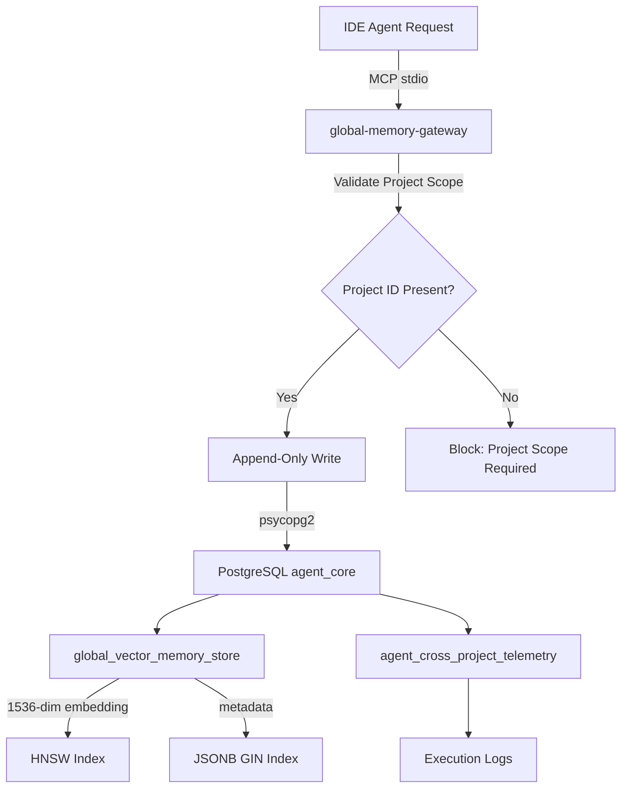
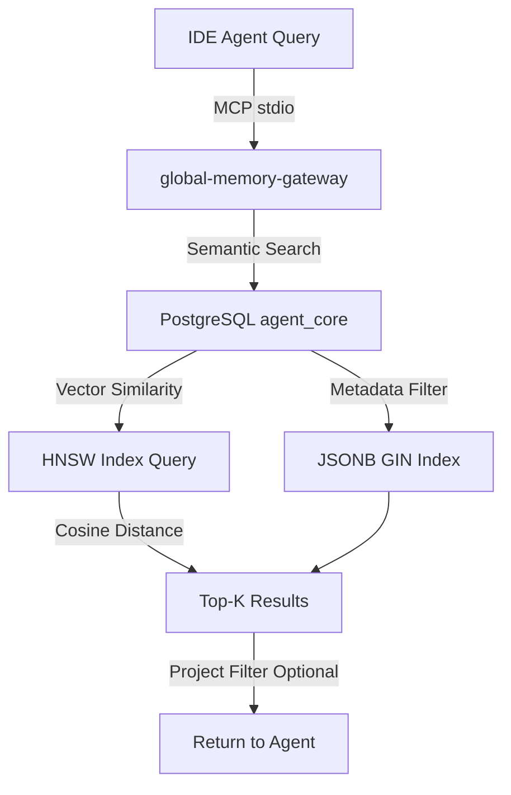
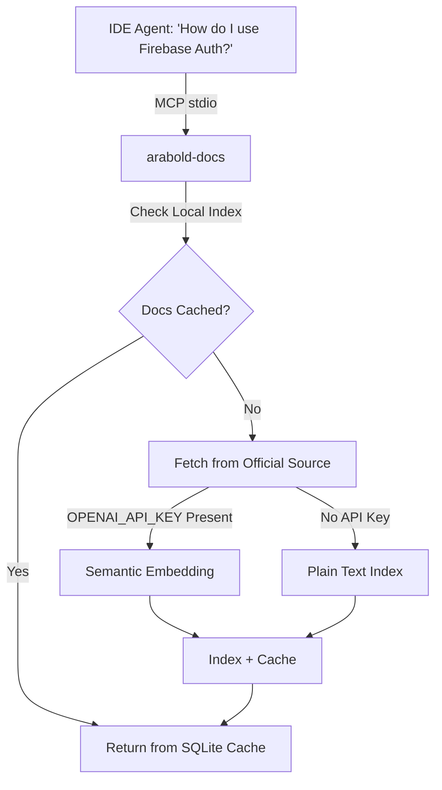
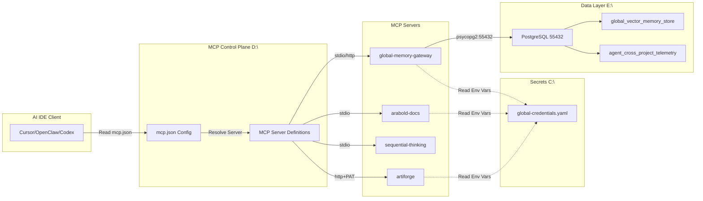

> **HISTORICAL EVIDENCE — NOT CURRENT DESIGN AUTHORITY**
> This document is the `D:\MCP-Control-Plane` ecosystem audit from 2026-06-20.
> It describes the state of the MCP control plane at that point in time.
> **Do not execute commands from this file without current operator approval.**
> **Do not treat `D:\MCP-Control-Plane` paths or claims here as the current source authority.**
> Current design authority: `D:\github\agentcore-control-plane` and `database-plan.md`.
> Current runtime facts: see `docs/handoffs/AGENTCORE_SWARM_ROLLOUT_HANDOFF_2026-06-30.md`.

---

# ECOSYSTEM ARCHITECTURE
**MCP Control Plane & PostgreSQL Vector Memory System**

**System ID**: CHAOSCENTRAL  
**Generated**: 2026-06-20  
**Authority**: ~~Single Source of Truth for MCP Governance~~ (superseded — see warning above)

---

## EXECUTIVE SUMMARY

This ecosystem connects AI IDE clients (Cursor, OpenClaw, Codex, Open Interpreter, MiniMax Code, Android Studio) to a centralized PostgreSQL 16 + pgvector database through a governed MCP (Model Context Protocol) control plane. All memory operations, documentation indexing, and agent tooling flow through strictly defined MCP servers with centralized secret management and deterministic validation.

**Critical Path**: IDE → MCP Control Plane → MCP Servers → PostgreSQL/External Services

---

## 1. INFRASTRUCTURE TOPOLOGY

### 1.1 Physical Layer

```
┌─────────────────────────────────────────────────────────────────┐
│                      DRIVE ARCHITECTURE                          │
├─────────────────────────────────────────────────────────────────┤
│ F:\ (NVMe 4TB)      │ Active AgentCore runtime and vector DB     │
│                     │ Location: F:\AgentCore\                   │
│                     │ Purpose: PostgreSQL, pgvector, workspaces  │
├─────────────────────────────────────────────────────────────────┤
│ E:\ (6TB Archive)   │ Cold archive and backup storage            │
│                     │ Location: E:\AgentCoreArchive\            │
│                     │ Purpose: snapshots, exports, raw archives │
├─────────────────────────────────────────────────────────────────┤
│ D:\ (Control Plane) │ MCP-Control-Plane Repository              │
│                     │ Codex_Managed: Agent runtime environment  │
│                     │ Purpose: Governance & orchestration       │
├─────────────────────────────────────────────────────────────────┤
│ C:\ (System)        │ Global Credentials & User Environment     │
│                     │ Location: C:\Users\ynotf\.mcp\            │
│                     │ Purpose: Secret management                │
└─────────────────────────────────────────────────────────────────┘
```

### 1.2 Database Layer

**PostgreSQL 16.6 with pgvector 0.8.2**

```yaml
Connection:
  Host: 127.0.0.1 (localhost loopback only)
  Port: 55432
  Database: agent_core
  User: postgres
  Auth: trust (local connections only)

Storage Engine:
  Binary Location: F:\AgentCore\postgres_runtime_engine\pgsql\
  Data Cluster: F:\AgentCore\database_cluster\
  Server Log: F:\AgentCore\database_cluster\server.log
  Process Management: pg_ctl (Windows service candidate)

Extensions:
  - pgvector 0.8.2 (HNSW indexing, 1536-dimensional vectors)
  - pgcrypto (UUID generation)

Tables:
  1. global_vector_memory_store
     - Primary Key: UUID
     - Embedding: VECTOR(1536) with HNSW index
     - Metadata: JSONB (GIN indexed)
     - Indexes: cosine similarity, agent+project composite
  
  2. agent_cross_project_telemetry
     - Primary Key: UUID (run_id)
     - Purpose: Cross-project execution monitoring
     - Indexes: timestamp DESC, tool_name, status
```

### 1.3 Secret Management

**Single Source of Truth**: `C:\Users\ynotf\.mcp\global-credentials.yaml`

```yaml
Scope: Windows User-level environment variables
Storage Policy: NEVER in config files, logs, or repositories

Required Secrets:
  - MEM0_API_KEY
  - MEM0_DEFAULT_USER_ID
  - ARTIFORGE_PAT
  - OPENAI_API_KEY
  - GITHUB_PERSONAL_ACCESS_TOKEN
  - CURSOR_API_KEY
  - COMPOSIO_API_KEY (quarantined)
  - OBSIDIAN_API_KEY
  - OBSIDIAN_LOCAL_REST_API

Reference Format:
  - ${env:SECRET_NAME}
  - ${ENV:SECRET_NAME}

Prohibited:
  - Hard-coded values in JSON/YAML/Markdown
  - Secret values in Git commits
  - Secrets in logs or reports
  - Machine-scope without approval
```

---

## 2. MCP CONTROL PLANE

### 2.1 Repository Structure

```
D:\MCP-Control-Plane\
├── supervisor\
│   ├── servers.json         # Canonical MCP server definitions
│   ├── servers.yaml         # Human-readable mirror
│   └── config.schema.json   # Validation schema
├── renderers\
│   ├── cursor-global.mcp.json              # Cursor IDE config
│   ├── open-interpreter.config.fragment.json
│   ├── openclaw.openclaw.fragment.json
│   ├── minimax.mcp.json
│   └── android-studio.mcp.json
├── registry\
│   ├── tool-registry.json   # Unified tool health & capability map
│   └── tool-registry.schema.json
├── schemas\tools\           # MCP tool JSON schemas (per-tool)
├── rules\
│   ├── global-mcp-routing.md        # Tool routing priority
│   └── environment-and-secrets.md   # Secret management rules
├── scripts\
│   └── mcp_control_plane.py # Orchestration & rendering engine
├── validators\
│   └── validate-control-plane.ps1
├── artifacts\               # Probe results, backups, reports
├── docs\                    # Generated documentation
└── AGENTS.md                # Agent contract & operating rules
```

### 2.2 MCP Server Catalog

#### **CRITICAL SERVERS** (Failure = Stop Execution)

1. **global-memory-gateway**
   - Transport: stdio
   - Location: `D:\Codex_Managed\.venv\Scripts\python.exe`
   - Purpose: Governed memory writes to PostgreSQL via Mem0 abstraction
   - Enforcement: READ globally, WRITE project-scoped only
   - Replaces: Raw Mem0 (quarantined for normal agents)

2. **arabold-docs**
   - Transport: stdio
   - Location: `C:\Users\ynotf\.cursor\vendor\arabold-docs-mcp\`
   - Purpose: Current library/framework/API documentation indexing
   - Replaces: Context7 (retired)
   - Requires: OPENAI_API_KEY (optional but improves semantic search)

3. **artiforge**
   - Transport: http
   - URL: `https://tools.artiforge.ai/mcp?pat=${env:ARTIFORGE_PAT}`
   - Purpose: High-leverage codebase scanning & architecture analysis
   - Usage: Strategic refactors only, not routine edits

4. **sequential-thinking**
   - Transport: stdio
   - Purpose: Planning, strategy, debugging workflows
   - Replaces: thinking-patterns (retired)

#### **NORMAL SERVERS** (Degraded Service Allowed)

5. **context-fabric**
   - Transport: stdio
   - Purpose: Git drift tracking, commit context capture
   - Constraint: Only initialize in Git-managed project workspaces
   - WARNING: Do NOT init in global infrastructure directories

6. **serena**
   - Transport: stdio via uvx
   - Purpose: Symbol navigation, precise refactors, agent handoffs
   - Usage: Before cross-file edits or architecture-aware changes

7. **obsidian-vault**
   - Transport: stdio (PowerShell wrapper)
   - Purpose: Durable human-readable knowledge base
   - Local REST API: https://127.0.0.1:27124

8. **github-mcp**
   - Transport: stdio (Docker)
   - Purpose: PR automation, Actions intelligence

9. **playwright**
   - Transport: stdio
   - Purpose: Browser automation, UI validation

10. **cursor-agent-mcp**
    - Transport: stdio
    - Purpose: Cursor Agent Bridge for IDE integration

11. **filesystem**
    - Transport: stdio
    - Purpose: File read/write with approved root access

12. **mcp-debugger**
    - Transport: stdio
    - Purpose: Runtime debugging, breakpoints, stack inspection

#### **QUARANTINED SERVERS** (Do Not Render)

- **mem0_mcp_server**: Raw Mem0 cloud API (bypass governance)
- **composio**: Unstable runtime state
- **context7**: Retired, replaced by arabold-docs

---

## 3. DATA FLOW ARCHITECTURE

### 3.1 Memory Write Path (Governed)



### 3.2 Memory Read Path (Global)



### 3.3 Documentation Query Path



### 3.4 Complete Agent Workflow



---

## 4. AGENT MEMORY GOVERNANCE

### 4.1 Memory Write Rules

**STRICT ENFORCEMENT**: All writes MUST flow through `global-memory-gateway`

```python
# CORRECT: Project-scoped write through gateway
memory_append(
    content="User prefers FastAPI over Flask for API development",
    project_id="chaoscentral/api-gateway",
    user_id="master_developer_profile",
    metadata={"category": "preference", "tech_stack": "python"}
)

# WRONG: Direct Mem0 write (BLOCKED)
mem0.add(content="...", user_id="...")  # Bypasses project scope governance

# WRONG: Write without project_id (BLOCKED)
memory_append(content="...", user_id="...")  # Missing project scope
```

### 4.2 Memory Read Rules

**ALLOWED**: Global reads across all projects

```python
# CORRECT: Search across all projects
memory_search(
    query="What are my Python testing preferences?",
    user_id="master_developer_profile",
    limit=10
)

# CORRECT: Filter by specific project
memory_search(
    query="API authentication patterns",
    user_id="master_developer_profile",
    project_id="chaoscentral/api-gateway"
)

# CORRECT: Cross-project pattern recognition
memory_search(
    query="How do I structure microservices?",
    user_id="master_developer_profile"
    # No project_id = search all projects
)
```

### 4.3 Vector Memory Schema

```sql
-- global_vector_memory_store table structure
CREATE TABLE global_vector_memory_store (
    id UUID PRIMARY KEY DEFAULT gen_random_uuid(),
    agent_signature TEXT NOT NULL,
    associated_project_path TEXT NOT NULL,
    document_source TEXT NOT NULL,
    content_chunk TEXT NOT NULL,
    embedding VECTOR(1536) NOT NULL,  -- OpenAI embedding standard
    metadata JSONB NOT NULL DEFAULT '{}'::jsonb,
    created_at TIMESTAMP WITH TIME ZONE DEFAULT CURRENT_TIMESTAMP
);

-- HNSW index for fast cosine similarity
CREATE INDEX idx_global_vector_memory_embedding_hnsw
    ON global_vector_memory_store
    USING hnsw (embedding vector_cosine_ops);

-- Composite index for agent + project filtering
CREATE INDEX idx_global_vector_memory_agent_project
    ON global_vector_memory_store (agent_signature, associated_project_path);

-- GIN index for metadata queries
CREATE INDEX idx_global_vector_memory_metadata
    ON global_vector_memory_store USING gin (metadata);
```

### 4.4 Telemetry Schema

```sql
-- agent_cross_project_telemetry table structure
CREATE TABLE agent_cross_project_telemetry (
    run_id UUID PRIMARY KEY DEFAULT gen_random_uuid(),
    agent_name TEXT NOT NULL,
    active_project_path TEXT NOT NULL,
    execution_status TEXT NOT NULL,
    shared_logs TEXT,
    last_sync_timestamp TIMESTAMP WITH TIME ZONE DEFAULT CURRENT_TIMESTAMP
);

-- Indexes for telemetry queries
CREATE INDEX idx_agent_cross_project_telemetry_agent_status
    ON agent_cross_project_telemetry (agent_name, execution_status);

CREATE INDEX idx_agent_cross_project_telemetry_last_sync
    ON agent_cross_project_telemetry (last_sync_timestamp DESC);
```

---

## 5. MCP SERVER TOOL ROUTING

### 5.1 Enforced Priority Order

Agents MUST consult tools in this order:

1. **Planning & Strategy**: `sequential-thinking`
   - Use for: ambiguous tasks, multi-step workflows, debugging strategy
   - Block on failure: Yes (no fallback)

2. **Code Exploration**: `serena`
   - Use for: symbol navigation, refactors, architecture-aware edits
   - Block on failure: No (fallback to native tools)

3. **Current Documentation**: `arabold-docs`
   - Use for: SDK/API/library guidance, version-specific behavior
   - Block on failure: Yes (do not use stale model memory)

4. **Governed Memory**: `global-memory-gateway`
   - Use for: ALL memory writes, global memory reads
   - Block on failure: Yes (do not bypass to raw Mem0)

5. **Project Continuity**: `context-fabric`
   - Use for: commit context, drift tracking
   - Constraint: Only in Git-managed workspaces
   - Block on failure: No

6. **Architecture Scan**: `artiforge`
   - Use for: high-leverage codebase analysis
   - Block on failure: Yes
   - Constraint: Strategic use only, not routine edits

7. **Browser/UI**: `playwright`
   - Use for: UI validation, page snapshots
   - Block on failure: No

8. **External Web**: Firecrawl or web search
   - Use for: current web evidence
   - Block on failure: No

9. **Connected Apps**: SaaS connectors
   - Use for: explicit user requests only
   - Block on failure: No

### 5.2 Fallback Policy

**Critical Tools** (global-memory-gateway, arabold-docs, artiforge, sequential-thinking):

```
IF primary_tool.status == FAILED:
    IF high_quality_fallback.exists():
        USE fallback
    ELSE:
        STOP execution
        NOTIFY user with:
            - failing_tool_name
            - error_evidence
            - repair_step
```

**Normal Tools**: Degrade gracefully, log warning, continue with reduced capabilities

---

## 6. CLIENT CONFIGURATION RENDERING

### 6.1 Renderer Targets

```yaml
Cursor Global:
  Path: C:\Users\ynotf\.cursor\mcp.json
  Format: { "mcpServers": {...} }
  Transport Priority: stdio, http with ${env:...} interpolation

Open Interpreter:
  Path: C:\Users\ynotf\AppData\Roaming\interpreter\config.json
  Format: { "mcpServers": {...} }
  Transport: stdio only

OpenClaw:
  Path: C:\Users\ynotf\.openclaw\openclaw.json
  Format: { "mcp": { "servers": {...} } }
  Transport: stdio, http

MiniMax Code:
  Path: C:\Users\ynotf\.mavis\mcp\mcp.json
  Format: { "mcpServers": {...} }
  Special: Artiforge requires PowerShell stdio wrapper (no env var interpolation)

Android Studio:
  Path: %APPDATA%\Google\AndroidStudio*\options\mcp.json
  Format: { "mcpServers": {...} }
  Transport: http only (httpUrl field)
  Limitation: No stdio support
```

### 6.2 Render Pipeline

```
1. Read supervisor/servers.json (canonical source)
2. Filter by client_bindings + lifecycle=active
3. Resolve transport (stdio/http)
4. Inject env_expectations as ${env:...} placeholders
5. Apply client-specific overrides (e.g., MiniMax Artiforge wrapper)
6. Validate against schemas
7. Write to renderers/ (repo-only, NOT live config)
8. BLOCK live write until probes pass
```

---

## 7. VALIDATION & HEALTH MONITORING

### 7.1 Probe Harness

```python
# Probe lifecycle: Initialize → tools/list → Validate
probe_stdio(
    canonical_id="global-memory-gateway",
    command="D:\Codex_Managed\.venv\Scripts\python.exe",
    args=["-m", "autonomy_factory.global_memory_gateway", "--user-id", "master_developer_profile"],
    env={"MEM0_DEFAULT_USER_ID": "master_developer_profile"},
    timeout=120
)

# Health states
healthy: tool responds, schema valid, latency acceptable
degraded: partial response or high latency
auth_failed: missing or invalid credentials
launch_failed: process crash or missing binary
timeout: no response within threshold
```

### 7.2 Continuous Validation

```
artifacts/probe-results.json → Tool health snapshot
registry/tool-registry.json → Capability + health map
validators/validate-control-plane.ps1 → Pre-rollout gate
```

---

## 8. OPERATIONAL PROCEDURES

### 8.1 Agent Memory Operations

**Write Pattern**:
```python
# Step 1: Agent requests memory write via MCP
mcp_call("memory_append", {
    "content": "User prefers Tailwind over Bootstrap for styling",
    "project_id": "chaoscentral/frontend",
    "user_id": "master_developer_profile",
    "metadata": {"category": "css_framework", "decision": "2026-06-20"}
})

# Step 2: global-memory-gateway validates project scope
# Step 3: Gateway generates 1536-dim embedding (if OPENAI_API_KEY present)
# Step 4: INSERT into global_vector_memory_store
# Step 5: Log to agent_cross_project_telemetry

# Step 6: Agent confirms write
# Output: { "status": "ok", "id": "uuid-here", "indexed": true }
```

**Read Pattern**:
```python
# Step 1: Agent queries memory
mcp_call("memory_search", {
    "query": "CSS framework preferences",
    "user_id": "master_developer_profile",
    "limit": 5
})

# Step 2: Gateway computes query embedding
# Step 3: PostgreSQL HNSW index executes:
#   SELECT id, content_chunk, 1 - (embedding <=> query_vec) AS similarity
#   FROM global_vector_memory_store
#   ORDER BY embedding <=> query_vec
#   LIMIT 5

# Step 4: Return ranked results
# Output: [
#   { "content": "...", "similarity": 0.92, "project": "..." },
#   ...
# ]
```

### 8.2 Documentation Query

```python
# Agent needs current Firebase Auth docs
mcp_call("arabold-docs", {
    "library": "firebase",
    "topic": "authentication",
    "version": "latest"
})

# arabold-docs checks local SQLite cache
# If stale or missing: fetch from firebase.google.com/docs
# Index with semantic embeddings (if OPENAI_API_KEY)
# Return structured markdown with code examples
```

### 8.3 Architecture Scan

```python
# High-leverage refactor planning
mcp_call("artiforge", {
    "action": "scan_codebase",
    "target": "D:/Codex_Managed/api-gateway",
    "focus": "dependency_analysis"
})

# Artiforge performs deep AST + dependency graph scan
# Returns refactor strategy, breaking changes, test coverage gaps
```

---

## 9. SECURITY BOUNDARIES

### 9.1 Network Isolation

```yaml
PostgreSQL:
  Bind Address: 127.0.0.1 (localhost only)
  Port: 55432 (non-standard to avoid conflicts)
  External Access: BLOCKED (firewall enforced)
  Authentication: trust for local connections only

MCP Servers:
  stdio Transport: IPC via stdin/stdout (no network)
  http Transport: localhost or authenticated external APIs
  Secret Injection: Environment variables only, never in config
```

### 9.2 Secret Handling

**PROHIBITED**:
- Hard-coded secrets in JSON/YAML
- Secrets in Git commits
- Secrets in logs or artifacts
- Secrets in screenshots or reports
- Secrets in email or Slack messages

**REQUIRED**:
- Windows User-scope environment variables
- `${env:SECRET_NAME}` placeholder references
- Validators MUST fail on literal secret detection

### 9.3 Quarantine Enforcement

```python
# Composio and raw Mem0 MUST NOT render into client configs
if server.lifecycle == "quarantined":
    if server.canonical_id in ["composio", "mem0_mcp_server"]:
        raise ValidationError(
            f"{server.canonical_id} is quarantined and must not be "
            f"rendered into client configs until explicitly re-enabled."
        )
```

---

## 10. FAILURE MODES & RECOVERY

### 10.1 Critical Server Failure

```
SYMPTOM: global-memory-gateway probe returns auth_failed

DIAGNOSIS:
1. Check MEM0_API_KEY in User-scope env vars
2. Verify D:\Codex_Managed\.venv\Scripts\python.exe exists
3. Check autonomy_factory package installation
4. Review E:\database_cluster\server.log for connection errors

RECOVERY:
1. Set MEM0_API_KEY in User environment
2. Restart terminal/IDE to inherit new env vars
3. Re-run probe: python D:\MCP-Control-Plane\scripts\mcp_control_plane.py
4. Verify artifacts/probe-results.json shows "healthy"
5. Restart all IDE clients
```

### 10.2 Database Connection Failure

```
SYMPTOM: psycopg2.OperationalError: could not connect to server

DIAGNOSIS:
1. Check PostgreSQL service: pg_ctl -D E:\database_cluster status
2. Verify port 55432 not blocked: netstat -an | findstr 55432
3. Check server.log: tail E:\database_cluster\server.log

RECOVERY:
1. Start PostgreSQL: pg_ctl -D E:\database_cluster start
2. Verify connection: psql -h 127.0.0.1 -p 55432 -U postgres -d agent_core
3. Test query: SELECT COUNT(*) FROM global_vector_memory_store;
```

### 10.3 Renderer Drift

```
SYMPTOM: Artiforge returns 401 Unauthorized in Cursor but works in OpenClaw

DIAGNOSIS:
1. Compare renderers/cursor-global.mcp.json with renderers/openclaw.openclaw.fragment.json
2. Check Cursor mcp.json uses ${env:ARTIFORGE_PAT} not ${ARTIFORGE_PAT}
3. Verify environment variable syntax matches client expectations

RECOVERY:
1. Backup current renderer: copy renderers\cursor-global.mcp.json + timestamp
2. Regenerate: python scripts\mcp_control_plane.py
3. Validate: .\validators\validate-control-plane.ps1
4. If passing: manually copy renderers\cursor-global.mcp.json to C:\Users\ynotf\.cursor\mcp.json
5. Restart Cursor
```

---

## 11. MAINTENANCE WINDOWS

### 11.1 PostgreSQL Maintenance

```bash
# Weekly vacuum to reclaim space and update statistics
psql -h 127.0.0.1 -p 55432 -U postgres -d agent_core -c "VACUUM ANALYZE;"

# Monthly reindex for HNSW performance
psql -h 127.0.0.1 -p 55432 -U postgres -d agent_core -c "REINDEX TABLE global_vector_memory_store;"

# Quarterly backup
pg_dump -h 127.0.0.1 -p 55432 -U postgres -d agent_core -Fc -f E:\backups\agent_core_$(Get-Date -Format yyyyMMdd).backup
```

### 11.2 Control Plane Regeneration

```powershell
# Generate fresh configs after server changes
cd D:\MCP-Control-Plane
python scripts\mcp_control_plane.py

# Output artifacts
ls artifacts\probe-results.json       # Health status
ls renderers\*.json                    # Client configs
ls registry\tool-registry.json         # Capability map
ls artifacts\final-status.json         # Rollout readiness
```

---

## 12. APPENDICES

### Appendix A: File Paths Quick Reference

```
Control Plane: D:\MCP-Control-Plane\
Database Cluster: E:\database_cluster\
PostgreSQL Binaries: F:\.postgres_runtime_engine\pgsql\
Agent Workspace: E:\agents_workspace\
Global Secrets: C:\Users\ynotf\.mcp\global-credentials.yaml
Cursor Config: C:\Users\ynotf\.cursor\mcp.json
Open Interpreter Config: C:\Users\ynotf\AppData\Roaming\interpreter\config.json
OpenClaw Config: C:\Users\ynotf\.openclaw\openclaw.json
MiniMax Config: C:\Users\ynotf\.mavis\mcp\mcp.json
```

### Appendix B: Connection Strings

```python
# PostgreSQL (Python psycopg2)
conn = psycopg2.connect(
    host="127.0.0.1",
    port=55432,
    dbname="agent_core",
    user="postgres"
)

# Environment variables for global-memory-gateway
os.environ["MEM0_DEFAULT_USER_ID"] = "master_developer_profile"
os.environ["AGENT_CORE_PGHOST"] = "127.0.0.1"
os.environ["AGENT_CORE_PGPORT"] = "55432"
os.environ["AGENT_CORE_PGDATABASE"] = "agent_core"
os.environ["AGENT_CORE_PGUSER"] = "postgres"
```

### Appendix C: MCP Schema Locations

```
Tool Schemas: D:\MCP-Control-Plane\schemas\tools\{server_name}\{tool_name}.schema.json
Server Catalog: D:\MCP-Control-Plane\supervisor\servers.json
Tool Registry: D:\MCP-Control-Plane\registry\tool-registry.json
Health Probes: D:\MCP-Control-Plane\artifacts\probe-results.json
```

---

## CHANGE LOG

**2026-06-20**: Initial architecture document generated from live system state  
**Authority**: This document is the canonical reference for all MCP Control Plane operations
