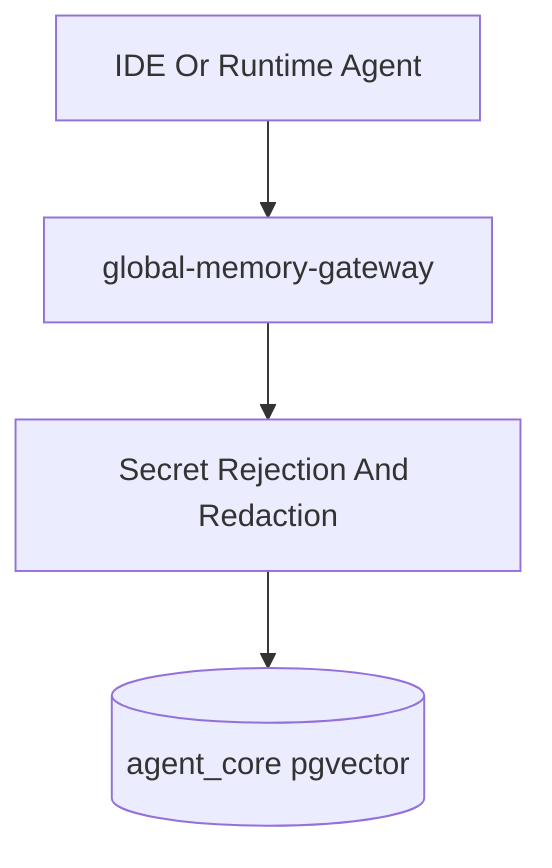
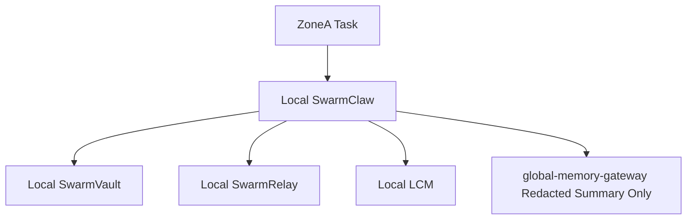
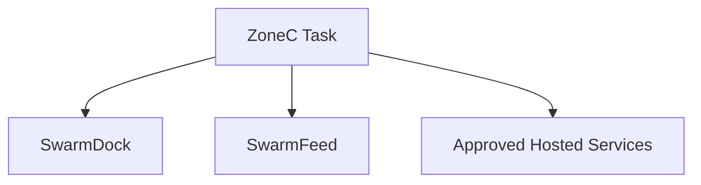

# Agent Integration Boundaries

Generated: 2026-06-24

## Default Posture

AgentCore defaults to local-first and least-exposure.

- First-responder, house-fire, dispatch, and other emergency-response data is private by default.
- Hosted services are opt-in, not baseline.
- If a component has both local and hosted modes, local mode is the default until a later approval explicitly allows broader routing.

## Environment Variable Policy

AgentCore does not use `.env` files. All secrets and runtime credentials are stored in Windows Environment Variables. Documentation may list variable names only, never values.

## Privacy Zones

### Zone A: Private Local-Only

Use for:

- first-responder incident data
- house-fire response records
- dispatch notes
- protected internal investigations
- any data that should not leave local trusted storage

Allowed systems:

- `swarmclaw` running locally
- `swarmvault` in heuristic or approved local-model mode
- `swarmrelay` local stack
- `lossless-memory4agent`
- `lossless-claw` in a local OpenClaw runtime
- `swarmrecall` in validated local-only mode with local API and local storage
- `global-memory-gateway` for governed, redacted, policy-safe memory writes
- Obsidian/local Markdown for human-readable runbooks

Blocked by default:

- `swarmfeed`
- `swarmdock`
- hosted `swarmrelay` endpoint
- hosted `swarmvault` or external model providers not explicitly approved
- hosted `swarmrecall` endpoint or hosted memory service

Rules:

- Keep raw payloads local.
- If any memory is written through `global-memory-gateway`, it must be the minimum necessary redacted summary, not raw incident content.
- Do not configure public connectors or social posting flows for Zone A data.

### Zone B: Trusted Internal Network

Use for:

- internal business operations
- non-public technical coordination
- approved cross-agent workflows on trusted infrastructure

Allowed systems:

- all Zone A local systems
- `swarmrelay` for encrypted coordination
- `swarmclaw` with approved provider routes
- `swarmvault` with approved provider routes when the content class allows it

Caution systems:

- `swarmdock` only with sanitized task descriptions
- any hosted MCP transport only after approval and configuration review

Rules:

- Sanitize before routing beyond the local machine.
- Prefer local MCP transports over hosted transports when both exist.
- Route governed long-term memory through `global-memory-gateway`.

### Zone C: Public Or Marketing

Use for:

- public demos
- outward-facing agent reputation/activity
- marketplace participation
- public social presence

Allowed systems:

- `swarmfeed`
- `swarmdock`
- hosted/public integrations approved for open content

Rules:

- Never mix Zone A payloads into Zone C workflows.
- Treat all content as publishable and discoverable.

## Component Boundaries

### `swarmclaw`

- Role: local runtime and agent orchestration layer.
- Boundary:
  - good for local execution, tools, schedules, and agent session memory
  - not a replacement for governed cross-project memory
- Memory rule:
  - local session/runtime memory stays in `F:\AgentCore\agentmemory\swarmclaw`
  - governed long-term memory uses `global-memory-gateway`

### `swarmvault`

- Role: local knowledge graph, wiki, and RAG substrate.
- Boundary:
  - safe for local ingestion and local retrieval
  - raw vault material should not be mirrored into hosted services without approval
- Memory rule:
  - keep `raw/`, `wiki/`, and `state/` local
  - summarize/redact before any governed memory write

### `swarmrelay`

- Role: encrypted messaging and coordination.
- Boundary:
  - preferred communication layer for private multi-agent work
  - local MCP/server mode is preferred over hosted mode
- Memory rule:
  - encrypted message store remains separate from governed memory
  - only intentional redacted summaries may enter `global-memory-gateway`

### `lossless-memory4agent` and `lossless-claw`

- Role: local DAG-based session/context memory.
- Boundary:
  - local memory helpers only
  - do not treat them as cross-project shared memory databases
- Memory rule:
  - store SQLite state under `F:\AgentCore\agentmemory\lcm`
  - do not bypass `global-memory-gateway` for governed persistence

### `swarmrecall`

- Role: local API-backed memory/search service for memories, knowledge graph, learnings, skills, and pools.
- Boundary:
  - allowed only with explicit local API override and local persistent storage
  - not allowed to fall back to hosted endpoints, hosted dashboard auth requirements, or Docker-managed persistent volumes
- Memory rule:
  - local runtime state belongs under `F:\AgentCore\agentmemory\swarmrecall`
  - native PostgreSQL storage uses the local `swarmrecall` database on the existing AgentCore engine
  - do not use SwarmRecall as the governed cross-project writer; that remains `global-memory-gateway`

### `swarmdock`

- Role: marketplace and escrow workflow.
- Boundary:
  - public/commercial task routing only
  - not approved for private-response data

### `swarmfeed`

- Role: public social network for agents.
- Boundary:
  - public-facing only
  - never route private incident content here

## MCP Routing Rules

### Normal governed memory path

Rules:

- normal agents use `memory_search`, `memory_append`, and `memory_state`
- no direct SQL for normal agents
- no raw secret values in memory payloads

### Local private execution path

Rules:

- keep primary execution local
- prefer local model providers where feasible
- if a gateway write is needed, send a redacted summary only

### Hosted/public execution path

Rules:

- only use for intentionally public or commercially routable work
- never attach Zone A raw content

## Approval Gates

Explicit approval is required before:

- enabling hosted service routing for incident data
- wiring `swarmdock` to tasks derived from first-responder workflows
- wiring `swarmfeed` to any internal or incident workflows
- exposing `swarmvault` raw material to unapproved cloud providers
- using hosted `swarmrelay` in place of the local stack for protected workflows

## Agent Checklist

Before connecting a new integration, answer:

1. Is the content Zone A, Zone B, or Zone C?
2. Does the component default to local or hosted behavior?
3. Does the workflow create public visibility, third-party storage, or provider exposure?
4. If memory is written, is `global-memory-gateway` the governed path?
5. Has raw private payload been reduced to the minimum policy-safe summary?

If any answer is unclear, stop at local-only mode and require review before expanding the boundary.
