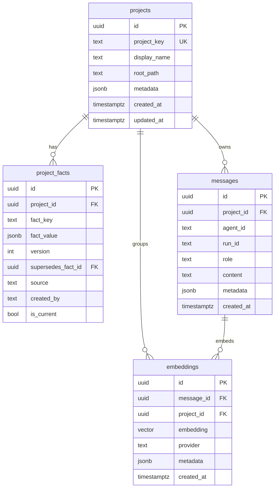
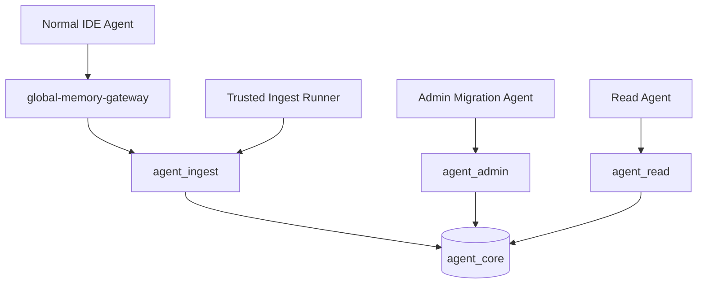

# AgentCore Database Overview

Generated: 2026-06-24

## Runtime

- Engine: PostgreSQL 16.6
- Extension: pgvector 0.8.2
- Host: `127.0.0.1`
- Port: `55432`
- Database: `agent_core`
- Engine directory: `F:\AgentCore\postgres_runtime_engine\pgsql`
- Data directory: `F:\AgentCore\database_cluster`
- WAL archive root: `E:\AgentCoreArchive\backups_cold\pgvector\wal`
- Base backup root: `E:\AgentCoreArchive\backups_cold\pgvector\base`

## Security Posture

- `listen_addresses = 'localhost'`
- `ssl = on`
- `ssl_min_protocol_version = 'TLSv1.2'`
- `password_encryption = 'scram-sha-256'`
- `pg_hba.conf` allows only localhost SSL connections for approved roles.
- Non-SSL localhost connections are rejected.
- All non-local IP ranges are rejected.
- Raw secrets must not be stored in vector memory or documentation.

## Roles

| Role | Purpose | Direct SQL | Privileges |
| --- | --- | --- | --- |
| `agent_admin` | migrations, schema maintenance, backup/restore validation | yes | superuser |
| `agent_ingest` | gateway and approved ingest writes | yes, constrained by grants | `SELECT` and `INSERT` on approved memory tables |
| `agent_read` | read-only inspection and validation | yes, read-only | `SELECT` only |
| `postgres` | break-glass local maintenance | yes | superuser |

Normal IDE agents must not connect directly to PostgreSQL. They must use `global-memory-gateway`.

Generated role passwords are stored as Windows User-scope environment variables:

- `AGENT_CORE_AGENT_ADMIN_PASSWORD`
- `AGENT_CORE_AGENT_INGEST_PASSWORD`
- `AGENT_CORE_AGENT_READ_PASSWORD`
- `AGENT_CORE_POSTGRES_PASSWORD`
- `AGENT_CORE_PGPASSWORD` only as an environment-variable alias when a process expects `PGPASSWORD`

## Environment Variable Policy

AgentCore does not use `.env` files. All secrets and runtime credentials are stored in Windows Environment Variables. Documentation may list variable names only, never values.

## Schema



Existing operational tables:

- `global_vector_memory_store`: canonical current vector memory table used by `global-memory-gateway`.
- `agent_cross_project_telemetry`: gateway, ingest, and validation telemetry.

New robust schema tables:

- `system_info`: keyed local system facts.
- `projects`: project identity and roots.
- `project_facts`: versioned immutable project facts and drift records.
- `messages`: episodic events and summaries.
- `embeddings`: normalized embedding records linked to projects/messages.

## Write-Class Policy



Normal agents use the MCP gateway. Trusted ingest and admin jobs are the only approved direct SQL writers.

## Backup And Restore

Backup script:

```powershell
D:\MCP-Control-Plane\ops\Backup-AgentCorePostgres.ps1
```

Restore validation script:

```powershell
D:\MCP-Control-Plane\ops\Test-AgentCorePostgresRestore.ps1
```

Daily backup schedule:

- Task: `AgentCore\NightlyBackup`
- Time: `03:00`
- Target: `E:\AgentCoreArchive\backups_cold\pgvector\base`

Daily restore verification:

- Task: `AgentCore\NightlyRestoreTest`
- Time: `03:30`
- Behavior: restores latest dump into `agent_core_restore_test`, validates `global_vector_memory_store`, then drops the disposable database.

WAL archiving:

- `archive_mode = on`
- archive command: `D:\MCP-Control-Plane\ops\Archive-AgentCoreWal.ps1`
- target: `E:\AgentCoreArchive\backups_cold\pgvector\wal`

## Validation Commands

```powershell
D:\MCP-Control-Plane\ops\Start-AgentCorePostgres.ps1
D:\MCP-Control-Plane\ops\Backup-AgentCorePostgres.ps1
D:\MCP-Control-Plane\ops\Test-AgentCorePostgresRestore.ps1
```
