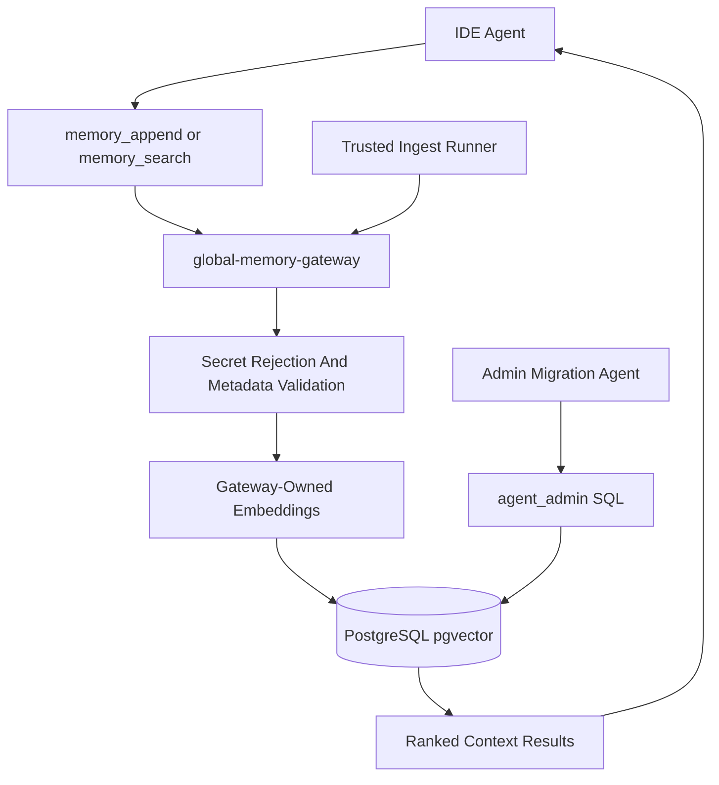

# AgentCore Memory System

Generated: 2026-06-24

## Summary

AgentCore memory is local-first.

- PostgreSQL/pgvector stores governed cross-project machine memory.
- `global-memory-gateway` is the normal write/read tool surface for IDE agents.
- Trusted ingest scripts load system evidence, reports, and inventories.
- Obsidian/local Markdown remain the long-form human-readable knowledge layer.
- QMD/LCM-style local memory remains separate and must not bypass the gateway for global memory writes.

## Environment Variable Policy

AgentCore does not use `.env` files. All secrets and runtime credentials are stored in Windows Environment Variables. Documentation may list variable names only, never values.

## Current Runtime Facts

- Active database: `127.0.0.1:55432/agent_core`
- Active vector table: `global_vector_memory_store`
- Active telemetry table: `agent_cross_project_telemetry`
- Active normalized tables: `system_info`, `projects`, `project_facts`, `messages`, `embeddings`
- Active drive: `F:\AgentCore`
- Archive drive: `E:\AgentCoreArchive`
- Canonical Git source repo: `D:\github\agentcore-control-plane`
- Current live ops root: `D:\MCP-Control-Plane`

## Memory Flow

## Data Classes

| Data class | Storage | Writer |
| --- | --- | --- |
| Episodic events | `messages`, `global_vector_memory_store` | gateway/trusted ingest |
| Semantic chunks | `embeddings`, `global_vector_memory_store` | gateway/trusted ingest |
| Static project facts | `project_facts` | drift checker/maintenance agent |
| Project metadata | `projects` | drift checker/admin |
| System inventory | `system_info`, vector memory | trusted ingest |
| Long-form runbooks | Markdown/Obsidian; compact index in pgvector | documentation agent |

## Local Memory Status

SwarmVault source and runtime:

- Source checkout exists at `D:\github\vendor\swarm\swarmvault`
- Vendored CLI build exists at `D:\github\vendor\swarm\swarmvault\packages\cli\dist\index.js`
- Runtime root exists at `F:\AgentCore\agentmemory\swarmvault`
- Verified initialized dirs:
  - `raw`
  - `wiki`
  - `state`
  - `agent`
- Verified local files:
  - `swarmvault.config.json`
  - `swarmvault.schema.md`
- Verified local posture:
  - heuristic provider
  - sqlite retrieval
  - no `.env` files in the runtime root

SwarmRecall source and runtime:

- Source checkout exists at `D:\github\vendor\swarm\swarmrecall`
- Built local artifacts exist for API, CLI, and MCP packages
- Runtime root exists at `F:\AgentCore\agentmemory\swarmrecall`
- Local config exists at `F:\AgentCore\agentmemory\swarmrecall\config\agentcore.swarmrecall.local.json`
- Local API is configured for `http://127.0.0.1:3300`
- Local search is configured for `http://127.0.0.1:7700`
- Local database is `swarmrecall` on the native PostgreSQL engine
- Local role is `swarmrecall_app`
- API listener is loopback-only on `127.0.0.1:3300`
- Exactly one native Meilisearch instance is expected on `127.0.0.1:7700`
- Meilisearch must not expose `--master-key` in its process command line
- Local-only posture is verified with:
  - no Upstash
  - dashboard auth disabled unless separately configured
  - local API-key registration
  - local CLI call
  - local MCP probe
- SwarmRecall remains separate from `global-memory-gateway` and is not yet enabled in live client configs.

LCM/lossless state:

Detected local memory file:

- `C:\Users\ynotf\.openclaw\agents\main\qmd\xdg-cache\qmd\index.sqlite`

Policy:

- Do not enable cloud services for SwarmVault.
- Keep SwarmVault/LCM local-only when the repo/runtime is installed.
- SwarmVault, SwarmRecall, and LCM may provide local retrieval/context paths, but global persistent memory writes must still use `global-memory-gateway` unless the caller is a trusted ingest/admin runner.

## Context Assembly

Agents should assemble context in this order:

1. Read task-local files.
2. Search `global-memory-gateway` for compact cross-project facts.
3. Use Obsidian/local Markdown for long-form handoffs.
4. Use QMD/LCM local context if the owning IDE provides it.
5. Avoid raw logs, full transcripts, and source dumps in vector memory.

## Agent Contract

Normal agents:

- use `memory_append`, `memory_search`, and `memory_state`
- do not write SQL directly
- do not choose embedding models or dimensions
- do not store raw secrets

Trusted ingest agents:

- may write direct SQL only if approved by `D:\MCP-Control-Plane`
- must attach `source_kind`, `document_source`, `associated_project_path`, `agent_id`, and `run_id`
- must reject or redact secret-like payloads before writing

Admin/migration agents:

- may perform schema, role, backup, restore, and repair work
- must back up config/schema before changes
- must validate rollback or restore
