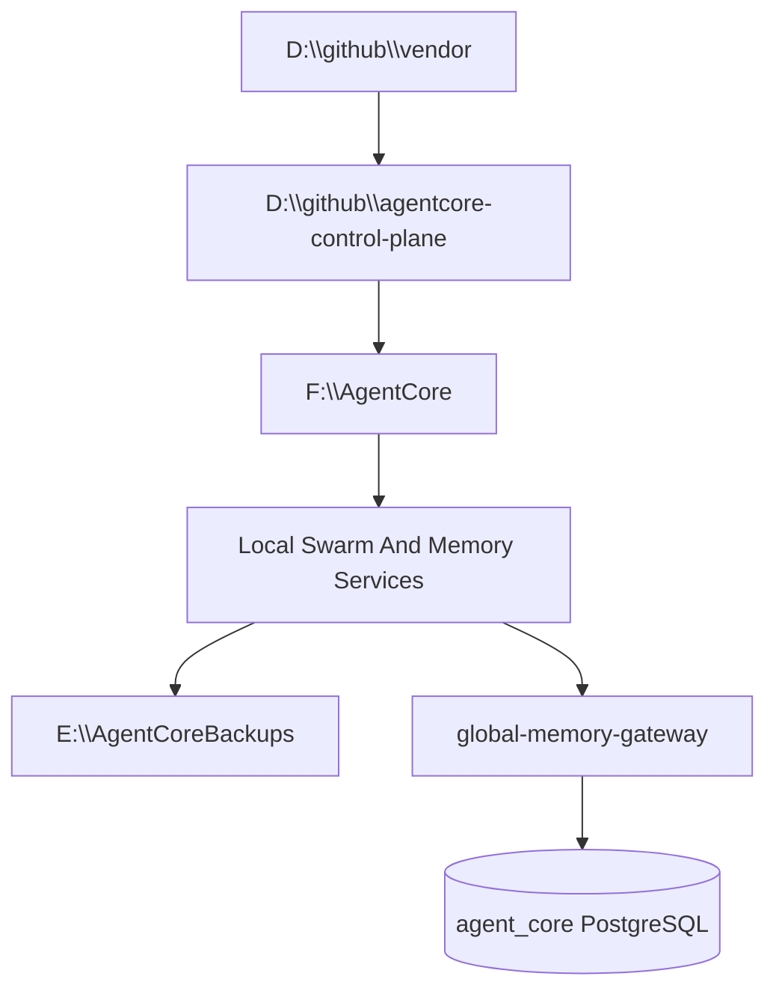

# Storage Layout

Generated: 2026-06-24

## Objective

Separate vendor source, AgentCore-owned control-plane code, runtime data, and backups so that:

- upstream repositories stay clean and pullable,
- runtime databases never land in Git,
- backups are isolated from active execution paths,
- IDE agents have one unambiguous answer for where things belong.

## Canonical Layout

```text
D:\
  github\
    vendor\
      swarm\
        swarmclaw\
        swarmvault\
        swarmdock\
        swarmfeed\
        swarmrelay\
      memory\
        lossless-memory4agent\
        lossless-claw\
    agentcore-control-plane\

F:\
  AgentCore\
    postgres\
    agentmemory\
      swarmvault\
      lcm\
      swarmclaw\
      swarmrelay\
    scratch\
    agents_workspace\
    backups_hot\
    database_cluster\
    ingestion_staging\
    postgres_runtime_engine\

E:\
  AgentCoreBackups\
    postgres\
    agentmemory\
    swarmvault-exports\
    logs\
```

## Zone Definitions

### Source zone: `D:\github`

- `D:\github\vendor` contains third-party source repositories only.
- `D:\github\agentcore-control-plane` contains AgentCore-owned governance, docs, scripts, schemas, renderers, validators, and repo metadata.
- No runtime databases, SQLite files, dumps, or active session state should be stored here.
- No vendor repo should be cloned into:
  - `F:\AgentCore\agents_workspace\Cursor`
  - `F:\AgentCore\agents_workspace\Codex`
  - `F:\AgentCore\agents_workspace\OpenClaw`
  - `F:\AgentCore\agents_workspace\MiniMax`
  - any business app project folder

### Runtime zone: `F:\AgentCore`

- `F:\AgentCore\postgres` is the normalized future-facing runtime directory for AgentCore-managed PostgreSQL assets.
- `F:\AgentCore\agentmemory` is the normalized root for local agent-memory systems.
- `F:\AgentCore\scratch` is the disposable working directory for temporary outputs and staging work.
- Existing operational directories remain valid and were not moved by this layout pass:
  - `F:\AgentCore\agents_workspace`
  - `F:\AgentCore\backups_hot`
  - `F:\AgentCore\database_cluster`
  - `F:\AgentCore\ingestion_staging`
  - `F:\AgentCore\postgres_runtime_engine`

### Backup zone: `E:\AgentCoreBackups`

- `E:\AgentCoreBackups\postgres` stores PostgreSQL backups, dumps, and WAL-oriented archive outputs.
- `E:\AgentCoreBackups\agentmemory` stores snapshots of local memory systems and related metadata.
- `E:\AgentCoreBackups\swarmvault-exports` stores vault exports and shareable non-runtime artifacts.
- `E:\AgentCoreBackups\logs` stores historical logs that should not live in the active repo or active runtime tree.

## Data Placement Rules

### Vendor source placement

- Clone each upstream repository once into `D:\github\vendor`.
- Pull/update vendor repos in place.
- Do not customize runtime state inside those clones.
- If local patches are ever needed, carry them as explicit branches or forks, not as mixed runtime/source directories.

### Runtime placement

- `swarmclaw` runtime state belongs under `F:\AgentCore\agentmemory\swarmclaw`.
- `swarmvault` runtime state belongs under `F:\AgentCore\agentmemory\swarmvault`.
- local LCM/lossless-memory state belongs under `F:\AgentCore\agentmemory\lcm`.
- `swarmrelay` runtime state belongs under `F:\AgentCore\agentmemory\swarmrelay`.
- PostgreSQL active data should stay on `F:\AgentCore`, with the current contract still referencing:
  - `F:\AgentCore\database_cluster`
  - `F:\AgentCore\postgres_runtime_engine\pgsql`

### Backup placement

- Backup copies go to `E:\AgentCoreBackups`, not back into the runtime tree and not into Git.
- Never store active databases or private incident payloads in the control-plane repo as a convenience copy.

## Data Flow



## Operating Boundaries

### What belongs in `D:\github\agentcore-control-plane`

- MCP supervisor definitions
- renderers
- schemas
- contracts
- validators
- operational scripts
- documentation
- inventory and non-secret registry metadata

### What does not belong in `D:\github\agentcore-control-plane`

- `.env` files
- API keys, passwords, private keys, or cert material
- SQLite files, Postgres dumps, or active DB clusters
- `raw/`, `wiki/`, `state/`, `runtime/`, `logs/`, `backups/`
- first-responder incident payloads or dispatch artifacts

## Current Contract Notes

- Existing memory and database contracts in this repo still reference the currently active PostgreSQL runtime paths under `F:\AgentCore\database_cluster` and `F:\AgentCore\postgres_runtime_engine`.
- This layout pass created the new standardized directories but did not migrate the live database or rewrite service configs.
- Existing `E:\AgentCoreArchive` references in inherited docs describe older archive conventions. The new standard for this repo is `E:\AgentCoreBackups`.

## Default Agent Guidance

1. Read and edit source in `D:\github`.
2. Write active runtime state only to `F:\AgentCore`.
3. Write cold backups only to `E:\AgentCoreBackups`.
4. Keep private-response data local-only unless a future approved design says otherwise.
